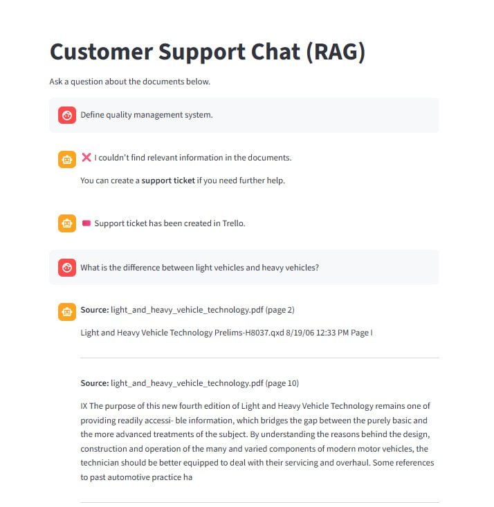
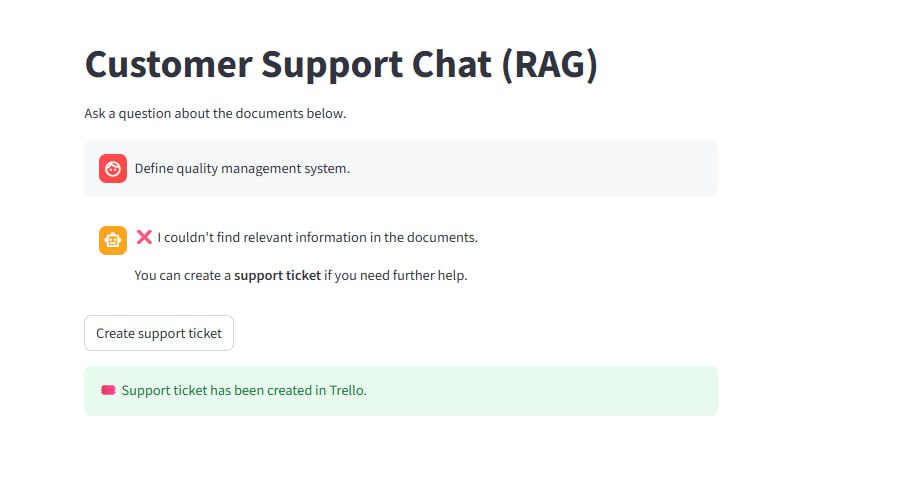
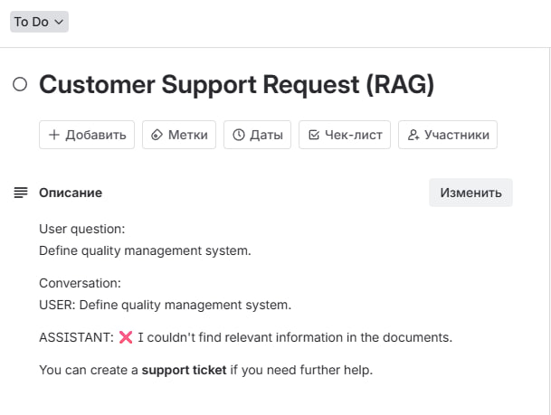

# Advanced Generative AI – Capstone Project 1  
## Customer Support Chat (RAG)

This project implements a **Retrieval-Augmented Generation (RAG)** based Customer Support system built with **Python and Streamlit**.

The system allows users to:

- Ask questions related to internal documentation
- Receive answers strictly grounded in PDF documents
- See the **source file name and page number**
- Create a real support ticket if no answer is found

The system is deployed on **HuggingFace Spaces**.

---

## 🌐 Live Demo

👉 **HuggingFace Space:**  
https://huggingface.co/Karina0202/project1

---

## 🎯 Project Objectives

This project satisfies all Capstone requirements:

- ✅ Web-based chat interface
- ✅ Retrieval-Augmented Generation (RAG)
- ✅ Vector database (ChromaDB)
- ✅ At least 3 documents used
- ✅ At least 2 PDF documents
- ✅ At least 1 PDF with 400+ pages
- ✅ Source citation (file + page number)
- ✅ Conversation history
- ✅ Support ticket creation (Trello)
- ✅ Function-calling style decision logic
- ✅ Hosted on HuggingFace Spaces

---

## 🧠 System Architecture

### RAG Pipeline

1. PDF documents are processed using **PyMuPDF**
2. Text is split into overlapping chunks
3. Each chunk is embedded using:

   sentence-transformers/all-MiniLM-L6-v2

4. Embeddings are stored in **ChromaDB**
5. User query is embedded
6. Most relevant chunks are retrieved
7. Results are filtered:
   - Semantic distance threshold
   - OCR noise detection
8. If relevant results exist:
   - Answer is shown
   - Source and page are displayed
9. If no relevant results:
   - User is prompted to create a support ticket
   - Ticket is sent to Trello

---

## 🖥️ User Interface

Built with **Streamlit**.

## 📸 Application Demonstration

### 1️⃣ RAG Answer Found

The system successfully retrieves relevant information from the indexed PDF documents.
The response includes:
- Source file name
- Page number
- Extracted content from the document

---

### 2️⃣ Support Ticket Creation (When No Answer Found)

If the system cannot find relevant information in the documents,
it suggests creating a support ticket.

After clicking the **Create support ticket** button,
a ticket is generated and sent to Trello.

---

### 3️⃣ Trello Confirmation (Real Ticket Created)

The support request is successfully created as a Trello card.
The card contains:
- User question

